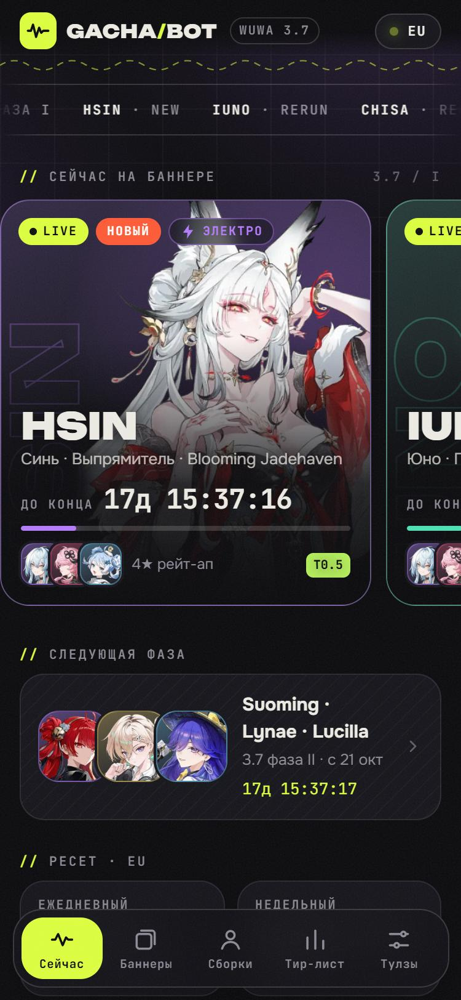
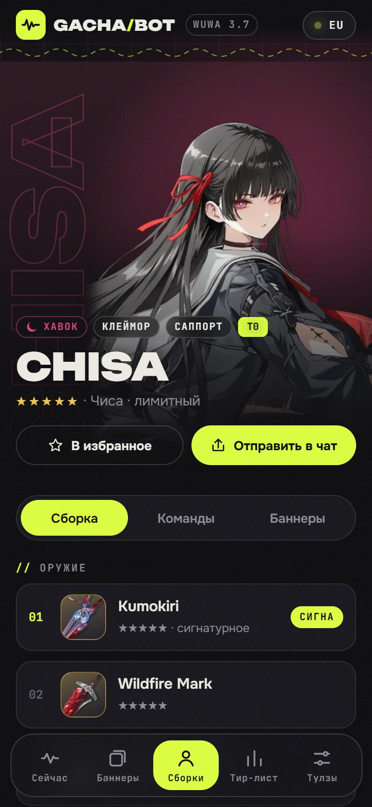
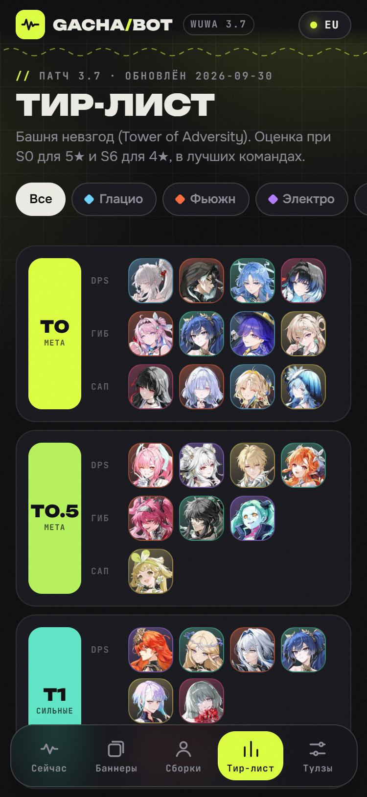
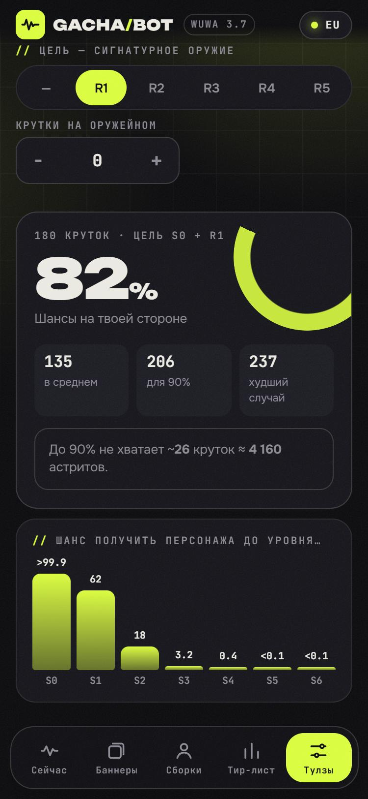

# GACHA/BOT — Wuthering Waves в Telegram

Mini App + бот по **Wuthering Waves**: текущие баннеры с таймерами, сборки всех 60 резонаторов, тир-лист, история реранов, калькулятор круток и коды. Всё на русском.

<p align="center">
  
  
  
  
</p>

## Что умеет

**Mini App** (`webapp/`, статический сайт без сборки на Vercel)

- **Сейчас** — карточки текущих баннеров с обратным отсчётом и прогрессом фазы, следующая фаза, ресеты, избранное, активные коды
- **Баннеры** — таймлайн всех конвентов с 1.0 по 3.7 и «засуха реранов»: кто дольше всех не выходил
- **Сборки** — поиск по-русски и по-английски («шк», «камелия», «Синь»), фильтры по стихии/оружию/редкости; у персонажа — оружие, сеты эхо с описанием, главное эхо, статы 4-3-3-1-1, сабстаты, прокачка навыков, команды и история баннеров
- **Тир-лист** — патч 3.7, Башня невзгод, разбивка DPS / гибрид / саппорт
- **Тулзы** — калькулятор шанса S0–S6 + R1–R5 (с графиком), планер астритов к нужной дате, трекер гаранта, справочник сетов эхо, коды, ресеты всех серверов
- Telegram-фишки: тема светлая/тёмная из Telegram, хаптика, кнопка «Назад», избранное и счётчики в **CloudStorage** (синхронизируются между устройствами), «Отправить в чат» через инлайн-режим, диплинки `?startapp=char_hsin`

**Бот** (`bot/` + `api/`, grammY, хостинг — Vercel)

- Пишешь имя персонажа — получаешь сборку с карточкой-превью
- `/banners` `/build имя` `/chars` `/history имя` `/drought` `/tier` `/codes` `/calc 28800 r1 гарант` `/reset` `/server` `/app`
- Инлайн-режим в любом чате: `@твой_бот синь` → карточка сборки
- В группах отвечает на команды, упоминания и ответы на свои сообщения
- Данные берёт из той же сборки — правишь JSON, пушишь, Vercel передеплоит и приложение, и бота

**Стиль** — «резонансный терминал»: чернильный фон с шумом и сеткой, кислотный акцент, вертикальные контурные имена, волна под шапкой. Шрифты: [Unbounded](https://fonts.google.com/specimen/Unbounded) (заголовки), [Onest](https://fonts.google.com/specimen/Onest) (текст), [JetBrains Mono](https://fonts.google.com/specimen/JetBrains+Mono) (таймеры и метки) — все с кириллицей.

## Запуск

Всё живёт в одном проекте на **Vercel**: папка `webapp/` — Mini App, `api/bot` — вебхук бота. Никаких серверов и GitHub Actions.

### 1. Бот в @BotFather

1. `/newbot` → получить токен
2. `/setinline` → включить инлайн-режим (плейсхолдер, например «имя персонажа»)

### 2. Проект на Vercel (бесплатно)

1. [vercel.com/new](https://vercel.com/new) → **Import Git Repository** → `gachabot`. Настройки сборки трогать не нужно — всё в `vercel.json`
2. **Settings → Environment Variables** — одна обязательная переменная:
   - `BOT_TOKEN` — токен от BotFather

   Необязательные: `MINIAPP_LINK` (`https://t.me/<бот>/app`, см. шаг 3), `WEBAPP_URL` (если Mini App на другом домене), `WEBHOOK_SECRET` (иначе вычисляется из токена), `UPSTASH_REDIS_REST_URL` + `UPSTASH_REDIS_REST_TOKEN` — бесплатная база [Upstash](https://upstash.com), чтобы бот запоминал выбранный сервер (без неё выбор сбрасывается на EU при «холодном» старте)
3. **Redeploy**, затем привязать вебхук — с компьютера, где есть токен:
   ```bash
   BOT_TOKEN=... npm run webhook -- https://<проект>.vercel.app
   ```
   Скрипт выставит вебхук, меню команд и кнопку Mini App и напечатает ссылку `/api/setup?key=…` для ручной перепривязки из браузера.

Готово: `/api/bot` принимает апдейты от Telegram, функция просыпается только на сообщения. Каждый пуш в `main` передеплоит и приложение, и бота.

### 3. Mini App в @BotFather (по желанию)

1. `/newapp` → URL `https://<проект>.vercel.app/`, короткое имя, например `app`. Получится ссылка `https://t.me/<бот>/app` — впиши её в `MINIAPP_LINK` на Vercel: тогда кнопки «Подробнее» работают и в группах, и в инлайн-режиме
2. **Bot Settings → Configure Mini App → Main App** — кнопка «Открыть» в профиле бота

Кнопку меню с Mini App в личке ставит `npm run webhook` (или `/api/setup`).

### Альтернатива: long polling (свой сервер)

```bash
npm install
cp .env.example .env   # вписать BOT_TOKEN, WEBAPP_URL, MINIAPP_LINK
npm start
```

Нужен постоянно включённый компьютер или сервер: VPS, Docker (`docker build -t gachabot . && docker run -d --env-file .env gachabot`), Railway/Render (тип «worker»). Запуск через polling снимает вебхук Vercel автоматически — одновременно оба способа не работают; чтобы вернуться на Vercel, снова запусти `npm run webhook`.

Посмотреть Mini App локально: `npm run web` → http://localhost:5173

## Как обновлять данные

Всё лежит в `webapp/data/`:

| Файл | Что внутри | Как обновлять |
|---|---|---|
| `banners.json` | все фазы: даты (время сервера Asia, UTC+8), featured, новые, 4★, оружие | руками, когда Kuro анонсирует фазу |
| `characters.json` | персонажи + сборки, тиры, команды | сборки руками; имена/стихии/картинки — `npm run sync` |
| `tierlist.json` | тир-лист по ролям | руками раз в патч |
| `codes.json` | коды обмена, `active: true/false` | руками |
| `echo-sets.json` | описания сетов эхо | руками при новых сетах |
| `weapons.json`, `echoes.json` | иконки оружия и эхо | генерирует `npm run sync` |

Пример новой фазы в `banners.json`:

```json
{
  "id": "3.8-1", "version": "3.8", "phase": 1, "kind": "event",
  "start": "2026-11-11T11:00", "end": "2026-12-02T09:59", "globalStart": true,
  "featured": ["new-char", "lupa"], "new": ["new-char"],
  "weapons": ["Signature Name", "Wildfire Mark"],
  "fourStars": ["sanhua", "aalto", "baizhi"], "weaponFourStars": []
}
```

`globalStart: true` — для старта версии (одновременно на всех серверах); смена фаз идёт по местному времени сервера.

После правок: `npm run check` (проверит, что все id существуют и картинки на месте) → коммит → пуш. Новых персонажей подтягивает `npm run sync -- --add`, сборку к ним нужно дописать.

## Модель калькулятора

5★ — 0.8% до 65-й крутки, затем рост (мягкий гарант), жёсткий гарант на 80-й; на баннере персонажа 50/50 с гарантом после проигрыша, на оружейном — 100%. Шаг роста шанса — оценка по статистике сообщества (средний итог ≈1.85%, как и в собранной игроками статистике), поэтому результат — ориентир.

## Структура

```
webapp/            Mini App (чистый HTML/CSS/JS без сборки)
  js/lib/          общая логика — её же использует бот: время серверов, модель круток, поиск
  js/views/        экраны
  data/            JSON-данные
  assets/          арты, иконки, карточки-превью
bot/               Telegram-бот (grammY): bot.js — обработчики, index.js — запуск через polling
api/               функции Vercel: bot.js — вебхук, setup.js — разовая настройка
scripts/           sync.mjs (данные и картинки), check.mjs (проверки), serve.mjs (локальный сервер)
```

## Источники

Базовые данные и арты — публичное API [encore.moe](https://encore.moe). Сборки, тиры и команды — сводка рекомендаций сообщества на патч 3.7. История баннеров — официальные анонсы.

Неофициальный фан-проект, не связан с Kuro Games. Wuthering Waves и все игровые материалы принадлежат их правообладателям.
